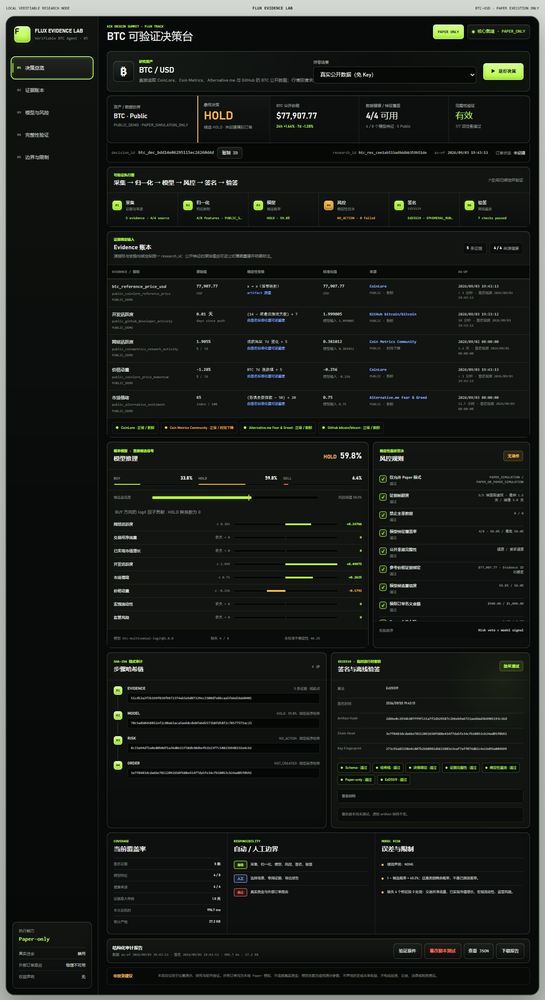
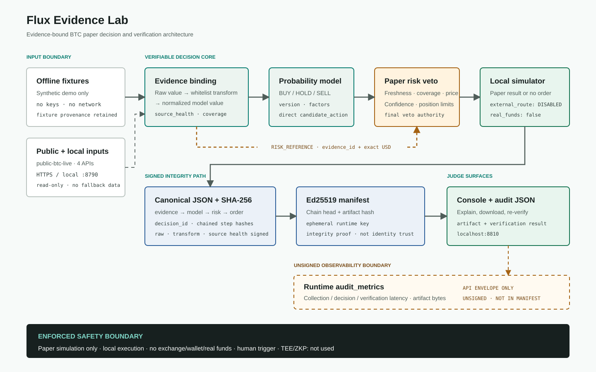

<div align="center">

# 🔎 Flux Evidence Lab

### Don't just trust an AI decision. Verify it.

**A verifiable evidence and audit layer for AI-assisted financial decisions.**

`Evidence → Model → Risk → Paper Decision → Cryptographic Verification`

**Built for AIx Origin Summit · Flux Track**

[简体中文](README.zh-CN.md) · [Architecture](docs/ARCHITECTURE.md) · [3-min Demo Script](docs/DEMO_SCRIPT_3MIN.md) · [Audit Sample](docs/AUDIT_REPORT_SAMPLE.md)

</div>

> **Paper-only by design.** No exchange, no wallet, no real funds, no live execution.

<p align="center">
  
</p>

## The problem

AI can generate a financial decision in seconds. A reviewer still needs to answer much harder questions:

- What evidence produced this decision?
- How did that evidence become model inputs?
- Did risk controls change the model's recommendation?
- Was an order actually created?
- Has anything been modified afterwards?

Most demos show the **answer**.

**Flux Evidence Lab preserves the decision trail.**

## What Flux Evidence Lab does

Flux Evidence Lab turns a BTC research decision into a replayable audit artifact:

```text
Public / offline evidence
        ↓
Deterministic feature transforms
        ↓
Versioned probabilistic model
        ↓
Candidate BUY / HOLD / SELL
        ↓
Deterministic risk veto
        ↓
Local Paper result
        ↓
SHA-256 chain + Ed25519 signature
        ↓
Independent verification + tamper detection
```

The responsibility boundary is deliberate:

- **Model proposes.** `btc-multinomial-logit@1.0.0` produces the candidate action, class probabilities, and per-feature contributions.
- **Risk decides.** `btc-paper-risk@1.1.0` is the final authority and can turn an actionable model candidate into `HOLD`.
- **Paper simulates.** Orders, balances, positions, and fills remain local demo records only.
- **Verifier checks.** A separate verification path replays evidence normalization, inference, risk evaluation, order construction, hash chaining, and signature validation.

## Why it is different

| Typical AI trading demo | Flux Evidence Lab |
| --- | --- |
| Shows a recommendation | Preserves the evidence trail |
| Model output is the final answer | Model proposes, risk decides |
| Hard to reproduce | Deterministic offline baseline |
| Output can be edited after the fact | Signed audit artifact |
| Verification depends on the UI | Independent verifier |
| Often implies execution | Paper-only boundary is enforced |

The project does **not** claim that the demo model predicts markets, is calibrated, or produces returns. The value of the prototype is traceability, reproducibility, explicit risk control, and post-run integrity checking.

## Core demo: verify, tamper, reject

The fastest way to understand the project is to run the offline baseline:

1. Run `offline-constructive`.
2. Generate a signed decision artifact.
3. Click **Verify Original** → the original artifact should verify.
4. Click **Tamper Copy**.
5. Verify again → the modified artifact should be rejected.

The verifier independently checks the full decision path, not just a front-end status badge.

Integrity has a limited meaning: SHA-256 and Ed25519 can detect changes after evidence has been collected and signed. They do **not** prove that upstream data is true, that the model is correct, that the strategy is profitable, that the signer has a persistent real-world identity, or that timestamps come from a trusted timestamping authority.

## Architecture

<p align="center">
  
</p>

A shared `decision_id` binds the `evidence → model → risk → order` payloads into a four-step SHA-256 chain. The resulting artifact is signed with an ephemeral Ed25519 runtime key; the private key is never written into the artifact.

For component boundaries and trust assumptions, see [docs/ARCHITECTURE.md](docs/ARCHITECTURE.md).

## Evidence and decision flow

1. Evidence is normalized with source, classification, observation time, and a stable `research_id`.
2. `public-btc-live` can read four keyless public sources: CoinLore, Coin Metrics Community, Alternative.me, and GitHub `bitcoin/bitcoin`.
3. Eight bounded features are mapped to `BUY` / `HOLD` / `SELL` probabilities and feature contributions.
4. The risk layer checks Paper-only mode, freshness, future evidence, feature coverage, source health, reference-price binding, model confidence, notional, position, inventory, and daily order limits.
5. A passing actionable decision creates a local `SIMULATED_ACCEPTED` record. A `HOLD` or risk veto creates `NOT_CREATED`.
6. The final artifact can be replayed and independently verified.

For live public data, retrieval time and source time remain separate. Responses are not cached or silently replaced by synthetic values when a public source fails.

## Demo scenarios

| Scenario | Input | What it demonstrates |
| --- | --- | --- |
| `offline-constructive` | Fixed synthetic fixture | Fresh evidence, model candidate, risk pass, local Paper order |
| `stale-evidence` | Fixed synthetic fixture | `EVIDENCE_FRESHNESS` veto; candidate remains visible, no order is created |
| `risk-limit` | Fixed synthetic fixture | `ORDER_NOTIONAL_LIMIT` veto; final action falls back to `HOLD` |
| `public-btc-live` | Four keyless public HTTPS sources | Request-time public evidence with explicit source status and time semantics |
| `local-8790` | Optional local read-only service | Review-only input; not a core dependency or executable Paper path |

The three offline scenarios are the reproducible baseline. Live public-source prices, timestamps, probabilities, availability, and resulting actions can change between runs.

## Quick start

**Requirements:** Node.js `>=20.11.0` (Node.js 24 recommended).

The offline baseline requires no database, API key, wallet, exchange account, or `.env` file.

```powershell
cd app
npm ci
npm run check
npm test
npm start
```

Open the local URL printed by the server, normally:

```text
http://127.0.0.1:8810
```

To use another port:

```powershell
$env:PORT = '8811'
npm start
```

The UI lets a reviewer run a scenario, inspect `research_id` and `decision_id`, review evidence and risk rules, re-verify the artifact, run an in-memory tamper test, inspect JSON, and download the report.

## Offline verification

Committed audit examples can be checked without network access:

```powershell
node tools/review-evidence.mjs --verify-examples
```

The local API exposes:

```text
GET  /api/health
GET  /api/scenarios
GET  /api/model-card
POST /api/run
GET  /api/reports/:id
POST /api/verify
```

See [docs/AUDIT_REPORT_SAMPLE.md](docs/AUDIT_REPORT_SAMPLE.md) for the field-by-field audit mapping and [examples/](examples/) for committed verification artifacts.

## Safety and compliance boundary

This repository is a competition demonstration and software-research prototype. It is **not** a broker, exchange, investment adviser, custodian, wallet, or live execution service.

- No exchange connectivity
- No wallet connectivity
- No account credentials or real funds
- No external order route
- No live execution mode
- No investment, performance, or accuracy claim
- No implicit short selling; Paper `SELL` requires simulated inventory

`public-btc-live` uses real public inputs, but execution remains simulated. “Paper-only” describes the account, order, position, and fill boundary; it does not re-label public market data as synthetic.

See [docs/COMPLIANCE.md](docs/COMPLIANCE.md) for the complete data, network, cross-border, and responsibility boundary.

## Repository map

```text
app/
├─ server.js                 # local HTTP API + console server
├─ public/                   # judge console
├─ src/adapters/             # public BTC read-only adapter
├─ src/core/                 # evidence, model, risk, chain, signing, verification
├─ model/                    # frozen transparent model artifact
├─ fixtures/                 # reproducible offline scenarios
└─ test/                     # Node native tests

docs/                        # architecture, compliance, testing, demo, submission notes
examples/                    # committed independently verifiable audit examples
promo/agent-ui/              # judge-console screenshots
tools/                       # audit review + portable handoff helpers
```

## Documentation

- [Architecture](docs/ARCHITECTURE.md)
- [3-minute demo script](docs/DEMO_SCRIPT_3MIN.md)
- [Audit report sample](docs/AUDIT_REPORT_SAMPLE.md)
- [Test plan](docs/TEST_PLAN.md)
- [Test report](docs/TEST_REPORT.md)
- [Compliance boundary](docs/COMPLIANCE.md)
- [Competition requirements matrix](docs/COMPETITION_REQUIREMENTS_MATRIX.md)
- [Prior-work disclosure](docs/PRIOR_WORK_DISCLOSURE.md)
- [Third-party notices](docs/THIRD_PARTY_NOTICES.md)
- [Submission notes](docs/SUBMISSION.md)

## Source checkout vs. portable handoff

This GitHub repository is the **source repository**. The historical Windows portable handoff is a separate delivery artifact and may contain a bundled runtime and generated offline-kit files that are intentionally not committed here.

The retained [manifest.sha256](manifest.sha256) documents provenance for that portable artifact; a normal source checkout is therefore not expected to match the portable-package manifest. Current-source test results and historical portable-candidate results should be treated as separate evidence.

## License

**UNLICENSED pending an explicit team decision.** No MIT, Apache-2.0, or other project license has been added without team authorization. See [docs/LICENSE-DECISION.md](docs/LICENSE-DECISION.md).
