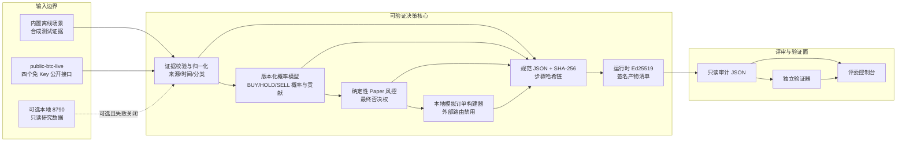
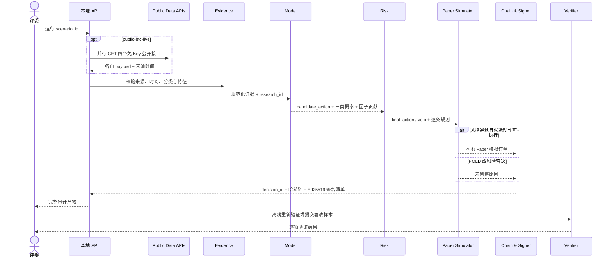

# 系统架构

## 设计目标

Flux Evidence Lab 解决的不是“给出一个交易结论”，而是让评委能够逐步回答四个问题：输入证据是什么、模型为何产生候选动作、风控为何放行或否决、产物是否被修改过。系统严格限制在 BTC Paper 模拟，不包含实盘执行路径。

产品主要面向数字资产研究员和模型风险/风控复核人员，次要面向审计、合规与工程复核人员。评委控制台是这些复核工作流的比赛演示面，不代表面向公众提供交易服务。

## 组件图

以下 Mermaid 图是当前架构的文档真源，便于评委直接复核并随实现同步修改；提交包内的 `architecture-diagram.svg` 是便于离线查看的同步派生图：



离线 fixtures 与 `public-btc-live` 都进入同一核心；后者只是在证据归一化之前增加一次只读公开数据采集。`public-btc-live` 不缓存响应、不回退合成数据；本地 `8790` 是另一条可选只读输入。即使所有外部服务不可用，三个内置离线场景仍可完整运行和验证。

## 显式边界

- **External network boundary**：只有 `public-btc-live` 在运行时向四个免 Key HTTPS 来源发起公开查询；原始响应只在内存中解析，不进入 artifact、日志或仓库。离线场景不依赖网络。
- **Local execution boundary**：HTTP 服务只绑定 `127.0.0.1`，报告保存在进程内内存；可选 `local-8790` 是本机只读、未验证的 review-only 输入，使用 `LOCAL_REVIEW_ONLY` 风控模式，不能生成 Paper 订单。
- **Paper-only boundary**：订单构建器只输出 `PAPER_SIMULATION_ONLY` / `external_route: DISABLED` / `real_funds: false`；不存在交易所、钱包、账户或真实下单接口。
- **Human trigger / confirmation point**：人工选择场景、点击运行、查看结果和触发验证；点击后证据归一化、模型、风控、Paper 结果和验证由程序完成。当前没有实盘前人工批准功能，最终比赛提交和合规确认由授权团队成员人工完成。
- **TEE / ZKP**：Not used in current prototype. 当前没有可信执行环境、零知识证明或全同态加密实现，架构图不把它们作为安全承诺。

## 决策时序



## 人机责任边界

人工负责选择场景、点击运行、解释结果、触发验证、复核提交包和执行最终外部提交。点击运行之后，证据归一化、模型推理、风险判断和本地 Paper 订单状态由程序自动产生，不允许人工在链路中改写结果。

当前系统没有真实金融动作，因此不存在“实盘下单前人工批准”步骤，也不得把旧系统中的解锁/确认能力算入本比赛模块。如果未来接入交易所或真实资金，必须新增独立身份、权限、二次确认、撤销和审计机制；这些能力不在当前架构与提交范围内。若比赛规则要求连 Paper 结果也必须二次人工批准，当前实现只能标记为待补，不能通过文案宣称已经满足。

## 核心数据契约

### 证据层

每条证据必须包含唯一 `evidence_id`、指标名、角色、有限数值、观测时间、分类以及来源。角色只允许 `MODEL_FEATURE` 或 `RISK_REFERENCE`。数据分类只允许：

- `SYNTHETIC_DEMO`；
- `PUBLIC_DEMO`；
- `MIXED_PUBLIC_SYNTHETIC_DEMO`。

来源类型只允许 `SYNTHETIC` 或 `PUBLIC`。HTTP(S) URL 可选，但不能用一个 URL 的存在替代来源真实性审查。公开变换证据还必须保存 `raw.value`、单位、字段路径、白名单 `transform_id`、来源 ID/类别、抓取时间、源时间、时间依据和状态；核心根据固定注册表重算输出值，不接受调用方自定义公式。证据、`source_health` 和 `collection` 摘要都会进入 `research_id` 与签名产物，并按稳定规则排序。

### 真实公开数据适配器

`public-btc-live` 每次调用并行读取：

| 来源 | 输入角色 | 时间语义 | 当前新鲜度上限 |
| --- | --- | --- | --- |
| CoinLore | `RISK_REFERENCE` BTC 美元参考价；`MODEL_FEATURE` 7d 动量 | 请求时抓取的市场快照 | 参考价 30 分钟；动量 180 分钟 |
| Coin Metrics Community | `MODEL_FEATURE` 活跃地址 7d 变化 | `1d` 序列，保留最新源行时间 | 4,320 分钟 |
| Alternative.me | `MODEL_FEATURE` Fear & Greed | 来源日度时间戳 | 2,880 分钟 |
| GitHub `bitcoin/bitcoin` | `MODEL_FEATURE` 距最近 `pushed_at` 天数 | 随开发活动更新，不是市场 tick | 43,200 分钟 |

适配器同时记录 `retrievedAt` 和来源自己的 `asOf`。四种输入更新频率不同，不被描述为严格同步的市场快照。CoinLore 市场源是 Paper 参考价格的硬依赖，失败时返回 `502`；其余来源部分失败时，状态和错误会进入 `source_status`，模型只使用仍可用的真实公开特征，绝不填入合成值。变换绑定的公开 collection 发生部分失败时会标记 `DEGRADED`；确定性风控通过 `SOURCE_HEALTH` 和至少 50% 的 `FEATURE_COVERAGE` 阻断可执行动作。所有原始 payload 只在进程内短暂解析，`cached: false`，不落盘。

### 模型层

模型 `btc-multinomial-logit@1.0.0` 接收八个范围限制在 `[-3, 3]` 的标准化特征。缺失特征显式记录并以中性值零参与推理。输出包括：

- 三类 logits 与 softmax 概率；
- 最高概率对应的 `candidate_action`；
- 每个特征对每一类 logit 的贡献；
- 模型版本、用途边界和 `performance_claim: NONE`。

模型直接决定候选动作，是决策主路径的一部分。它不是 LLM 摘要，也不是隐藏规则的展示层。

该模型不是生成式 LLM，所以没有自由文本生成幻觉路径；它仍可能因错误或过期上游输入、缺失特征零填充、演示参数偏差、类别边界、概率未校准或分布漂移而误判。模型解释只复算内部贡献，不证明市场因果。当前没有预测准确率、校准或盈利性证据。

### 风控层

风控策略 `btc-paper-risk@1.1.0` 是确定性的最终控制层。默认检查：

1. 仅允许 Paper 模式；
2. 按白名单变换策略逐指标检查证据新鲜度；
3. 不接受未来时间证据；
4. 模型特征覆盖率至少 50%；
5. 变换绑定的公开 collection 来源健康为 `HEALTHY`；
6. Paper 参考价唯一绑定到 `RISK_REFERENCE` 证据 ID 与数值；
7. 模型最低候选概率；
8. 模拟订单名义金额；
9. Paper 仓位占权益上限；
10. 卖出库存，禁止隐式做空；
11. 每日 Paper 订单数量。

模型输出 `HOLD` 时不创建订单。可执行候选动作触发任一失败规则时，`final_action` 回落为 `HOLD`，订单状态为未创建。

### Paper 模拟层

Paper 只表示订单执行、组合余额、仓位和成交是模拟的，并不把 `public-btc-live` 的公开市场输入改称模拟行情。Paper 订单只是一段本地审计数据：

- `execution_mode: PAPER_SIMULATION_ONLY`；
- `external_route: DISABLED`；
- `real_funds: false`；
- 不发送网络下单请求；
- 不读取交易账户、钱包或私钥。

## 标识与可追踪性

同一决策中的证据、模型、风控和订单阶段共享 `decision_id`。归一化证据快照另有 `research_id`。模拟订单有派生的 `paper_order_id`，并反向引用 `decision_id`。

```text
research_id ──绑定──> evidence snapshot
                         │
decision_id ─────────────┼──> model
                         ├──> risk
                         ├──> paper order / not-created reason
                         └──> hash chain + signature
```

验证器必须拒绝阶段 ID 不一致、顺序改变、步骤缺失或订单反向引用不一致的产物。对公开 collection，它还会重算原始值白名单变换、来源时间/状态、collection 摘要、特征覆盖率、`research_id` 和参考价绑定；攻击者即使重建哈希链并用新的临时密钥重签，也不能把这些内部矛盾变成有效产物。

## 完整性方案

### 规范 JSON

所有进入哈希的数据先经过确定性 JSON 规范化：对象键稳定排序，数组顺序保留，并拒绝无法稳定表达的值。规范化是跨调用复算一致性的基础。

### SHA-256 步骤链

阶段固定为 `evidence → model → risk → order`。每个步骤的哈希输入包含：

```text
domain separator
sequence
stage
decision_id
previous_hash
payload
```

首步使用 `GENESIS`，后续步骤引用前一步哈希。修改任何上游载荷会改变该步及所有后续哈希。

### Ed25519 证明

服务启动时生成临时 Ed25519 密钥对。私钥只存在于进程内闭包，不导出、不落盘、不进入报告；报告包含公钥、SHA-256 指纹、清单和签名。清单绑定无签名产物哈希、链头、每步哈希、核心结论和签名时间。验证器使用报告内公钥复算签名，同时检查公钥指纹。

### 运行耗时与证明体积

`POST /api/run` 在 artifact 外返回 `audit_metrics`，记录采集、决策链、离线验证和总耗时，以及序列化 artifact 字节数。评委控制台同时显示本次总耗时和审计产物体积，用于复核证明开销是否适合现场演示。

这些指标的 `integrity_scope` 固定为 `ARTIFACT_SIGNED_RUNTIME_METRICS_UNSIGNED`：artifact 本身进入签名清单，运行时测量值不在签名范围内。它们是性能遥测，不得被描述成可信时间戳或签名证明的一部分。

这里的签名证明“采集结果进入该产物并签名后未改变”。它不直接认证 CoinLore、Coin Metrics、Alternative.me 或 GitHub，不证明上游绝对真实、完整、同步或无误，也不证明模型盈利或决策适当。临时签名也不是长期身份或受信时间戳。

## 信任边界与失败策略

| 边界 | 默认信任 | 失败策略 |
| --- | --- | --- |
| 内置 fixture | 仅作为演示输入 | 结构或时间非法即拒绝运行 |
| `public-btc-live` | 信任 HTTPS 响应是当次收到的数据，不背书内容绝对真实性 | 保留来源、抓取/源时间；市场源失败关闭，其他失败显式降级且不补合成 |
| 第三方网络与司法辖区 | 不假设供应商处理地域、适用法或条款永久不变 | 只发送公开资产/指标/仓库查询，不发送账户、组合、凭据或主动收集的个人数据；正式使用前人工复核跨境与条款 |
| 本地 `8790` | 不信任，且仅只读 | 超时或异常时明确失败，不伪装在线成功 |
| 模型 | 信任固定版本的可重复计算，不信任其准确性、校准或盈利性 | 输出完整版本、概率、贡献、缺失特征和限制；由确定性风控约束行为 |
| 风控 | 信任确定性规则执行 | 任一硬规则失败则否决可执行动作 |
| 审计产物 | 默认可能被复制或修改 | 每次消费时重新验链与验签 |
| 浏览器 UI | 展示面，不是可信计算基 | 以核心 JSON 和验证器结果为准 |
| 人工操作者 | 不假设人工选择、解释或提交必然正确 | 操作显式可见；保留原始产物；最终视频、ZIP、许可与外部提交由授权成员复核 |

## 威胁模型

项目重点覆盖：

- 审计 JSON 单字段篡改；
- 哈希链步骤删除、换序或替换；
- `decision_id` / `research_id` 串线；
- 公钥或签名替换；
- 未来时间、过期或重复证据；
- 公开原始值与标准化特征不一致；
- 来源状态、时间、collection 摘要或特征覆盖率被改写；
- 风控参考价格与签名证据解绑；
- 超金额、超仓位、无库存卖出、超频率；
- 试图请求实盘模式；
- 公开接口失败后混入未披露合成数据；
- 把不同更新频率的来源误当成同一时点数据；
- 把模型类别概率误当成胜率，或把非生成式模型误判描述为“没有 AI 错误”；
- 向第三方接口误传个人、账户、组合或凭据数据；
- 提交包误带 `.env`、凭据、日志、缓存或账户数据。

项目不解决：输入数据供应商自身造假或错误、网络中断、不同源的时点偏差、模型准确率/校准/漂移、供应商实际处理地域与全部跨境法律判断、机器或 Node.js 运行时被完全攻陷、长期密钥身份、可信时间戳、市场操纵、真实撮合质量或投资收益验证。

## 可复现性

离线场景包含固定证据和 `as_of` 时间，因此模型、风控、`research_id`、`decision_id` 与链哈希可重复计算。运行时 Ed25519 密钥和签名时间可以变化，所以整份产物字节不要求跨进程完全相同；测试可注入受控 signer / 时间检查确定性路径。验证关注的是每一份产物自身的一致性。

## 部署边界

服务绑定本地回环接口，供同机评审。它不是多租户系统，没有鉴权、配额、持久化、灾备或公网加固，不应部署为开放交易服务。
